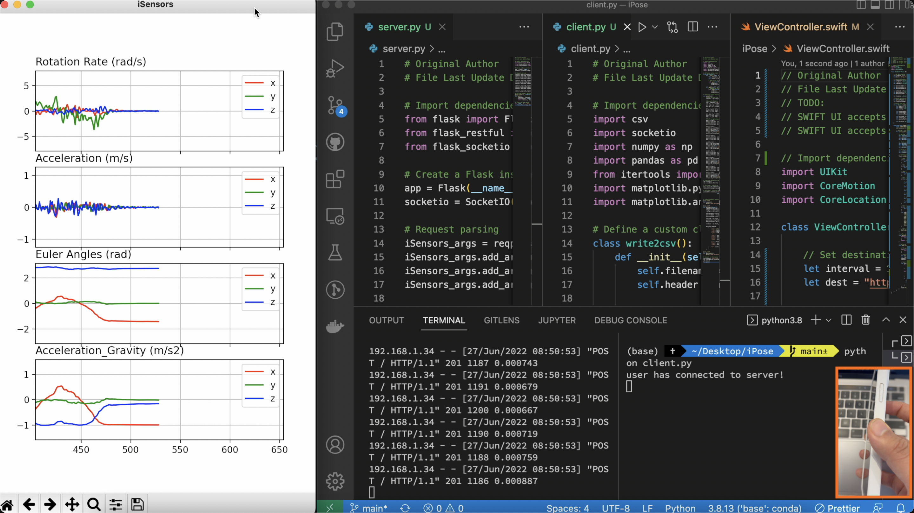

# **iPhone's pose measurement based on [Swift](https://developer.apple.com/swift/).**

**This is a Swift app, named 'iPose', for iPhone's pose measurement based on [Swift](https://developer.apple.com/swift/).**

*This is a side project to me in swarm robotics. TODO:*

*1 - Send iPhone's measurement into Python.*

*2 - Display iPhone's measurement in Python.* 

*3 - Create a simple UI for the app with start/stop button.*

*4 - Develope GPS aided IMU navigation system in Python.*

*5 - Get iPhone's 3D point clouds.*

*6 - Send iPhone's 3D point clouds into Python.*

*7 - Display iPhone's 3D point clouds in Python.*

*8 - Develope visual/LiDAR-aided 3D mapping system in Python.*

*9 - Develop visual/LiDAR-aided IMU navigation system in Python.*

*10 - Develop image/point cloud understanding/translation (multi-tasking) in Python.*

